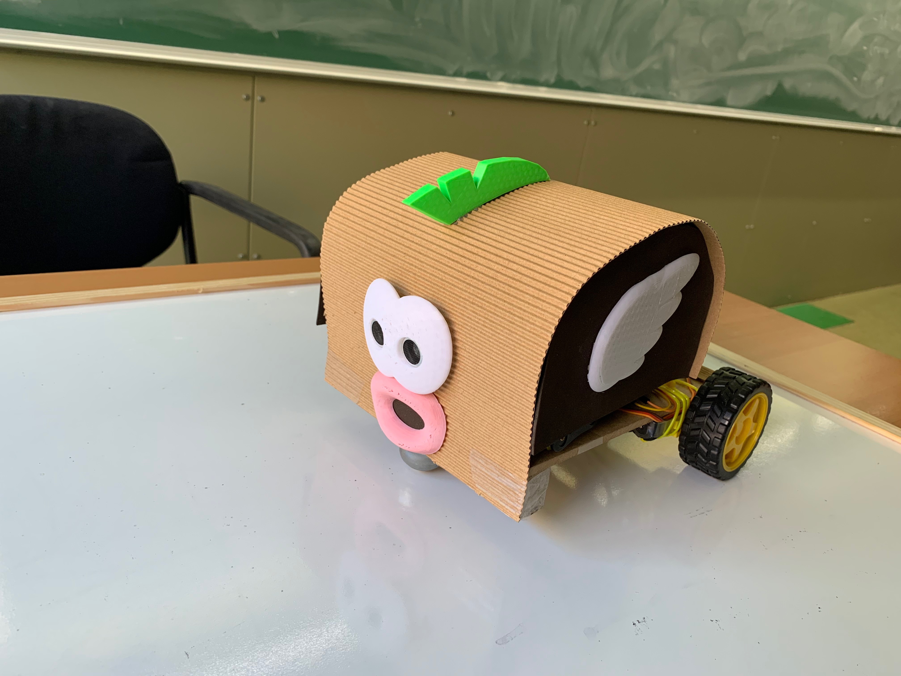
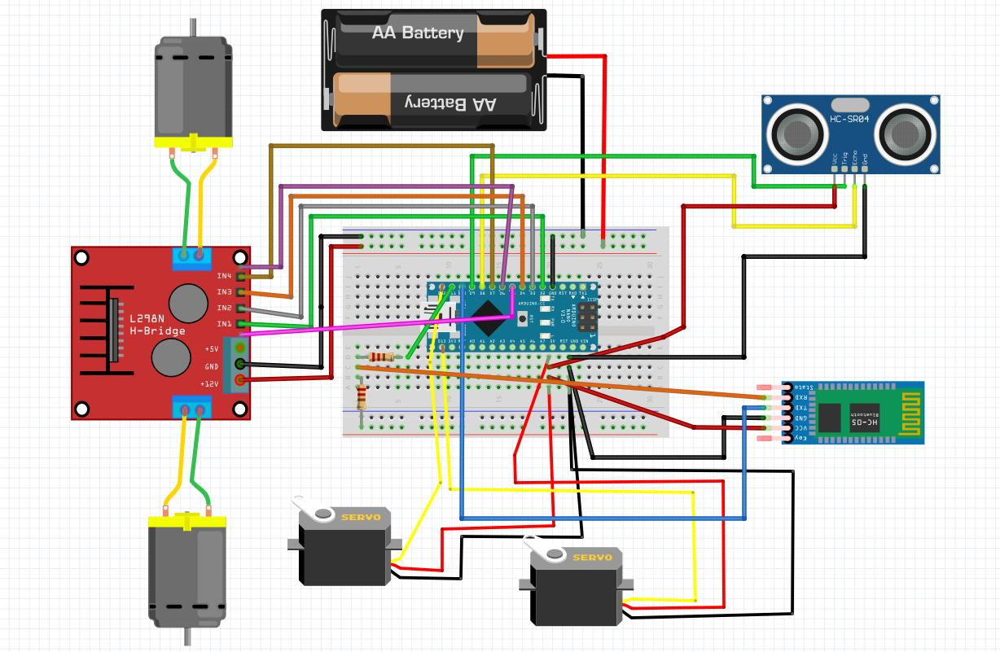
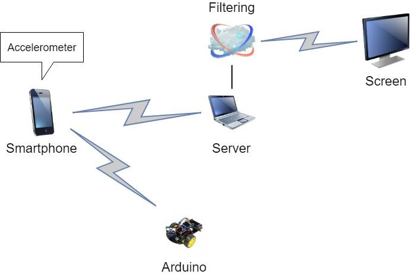
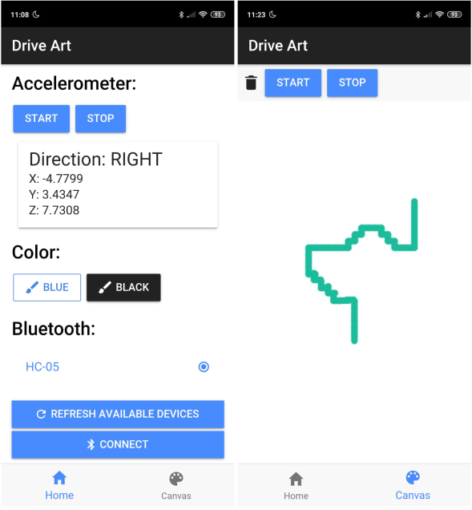
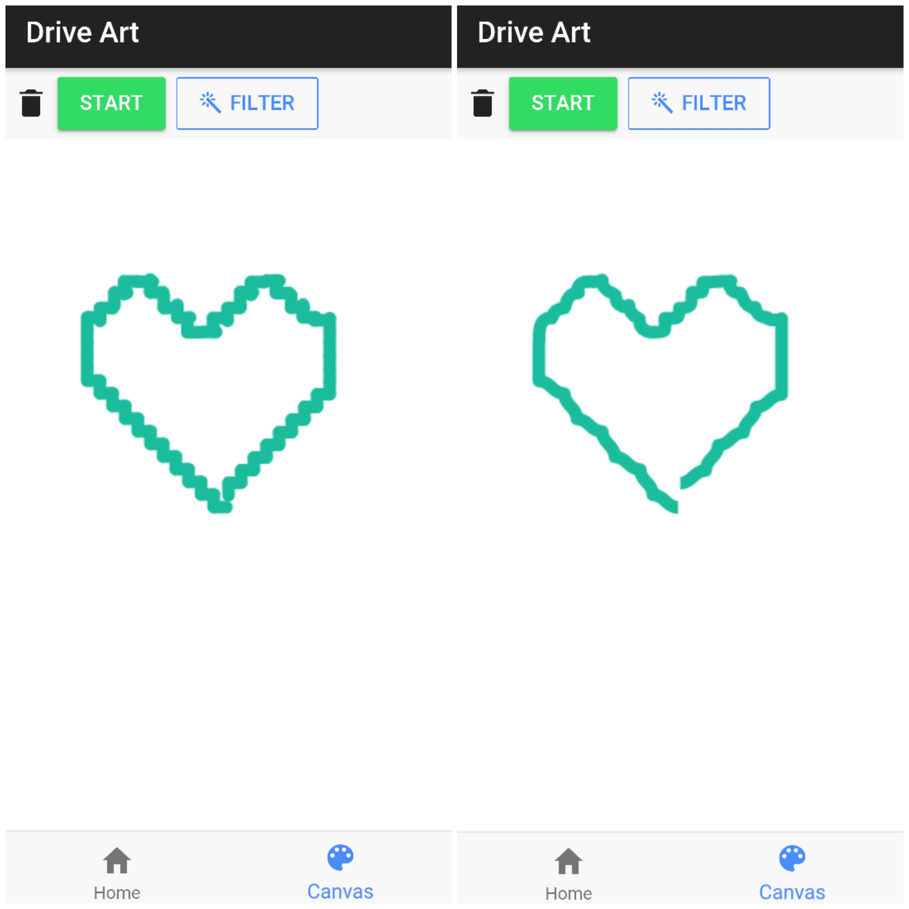

# DRIVE ART

Demostración: Youtube [video](https://youtu.be/gzK2sjRPkqg  "DriveArt: demostración").

## Descripción del proyecto
Drive Art es un coche robot controlado mediante los gestos que el usuario hace con la cabeza, que permite al usuario que lo controla realizar un dibujo físico (en el suelo). Drive Art dispone de un sensor de ultrasonidos frontal, que evitará que el coche choque con posibles
obstáculos.

Este proyecto se ha pensado para tener una posible utilidad para las personas con paraplejia, por ese motivo presenta este tipo de control mediante gestos, y busca la interacción con el usuario para garantizar entretenimiento y jugabilidad.

Para tal efecto se desarrollará una aplicación móbil que recoja los gestos realizados con la cabeza y se comunique a tiempo real con el robot. Además, teniendo en cuenta que el dibujo final que se realizará con los gestos puede no quedar bien definido debido a ruido o incluso pequeños movimientos involuntarios, se realzará un filtrado digital al dibujo una vez acabado, para mejorar la definición del trazado, y se mostrará por pantalla el resultado final.

## Componentes electrónicos
- Arduino nano
- HC-SR04 ultrasonic sensor
- Motor shield l298n
- Motores DC y ruedas
- Baterías AA recargables
- Base para baterías
- Módulo Bluetooth H-05
- Micro servo SG90
- Cables

Montaje del robot: [instructable](./docs/Instructable.pdf  "DriveArt: instructable").

## Esquema Hardware

A continuación, se muestra el esquema de conexiones de nuestro robot.

## Arquitectura Software

A continuación, se muestran los distintos módulos software que usaremos y cómo se comunican entre ellos y con los distintos dispositivos.

## Código Arduino

El Arduino está constantemente escuchando los datos que le llegan por el Bluetooth, y los interpreta para moverse en la dirección adecuada, para cambiar de color o detenerse.

Descargar el código [arduino](./arduino/codigo/codigo.ino  "DriveArt: código arduino").

## Código Aplicación móvil Ionic

Paralelamente al coche-robot, se ha estado desarrollando la aplicación móvil en Angular/Ionic3, la cual se comunica con el robot mediante Bluetooth.

A la izquierda, pantalla principal de la aplicación, donde se muestran los datos del acelerómetro y como se traducen a una dirección, la opción para cambiar de color, y la parte de la configuración del Bluetooth (a nivel de usuario). A la derecha, pantalla del lienzo, donde se realiza el dibujo digital a medida que el robot se mueve.

Repositorio del código [ionic](https://github.com/marinarierav/DriveArt  "DriveArt: código Ionic").

## Filtrado

A continuación se muestran unas imágenes de ejemplo de un dibujo proyectado a la aplicación, antes y tras el filtrado. Se ha aplicado un filtrado que utiliza las curvas de Bezier, porque de los diversos métodos analizados, es el tipo de filtrado que ha dado unos mejores resultados. Se puede ver como permite suavizar los trazados del dibujo, pero sin llegar a perder la definición de los contornos.

## Informe

Descargar el: [informe](./docs/report_sprint5.pdf  "DriveArt: informe final").

## Realizado por
- Stefany Ariana Chóez Bolaños
- Daniel Panadero Espinosa
- César Valcarce Pagán
- Marina Riera Velasco

Mayo 2019, Universitat Autònoma de Barcelona
